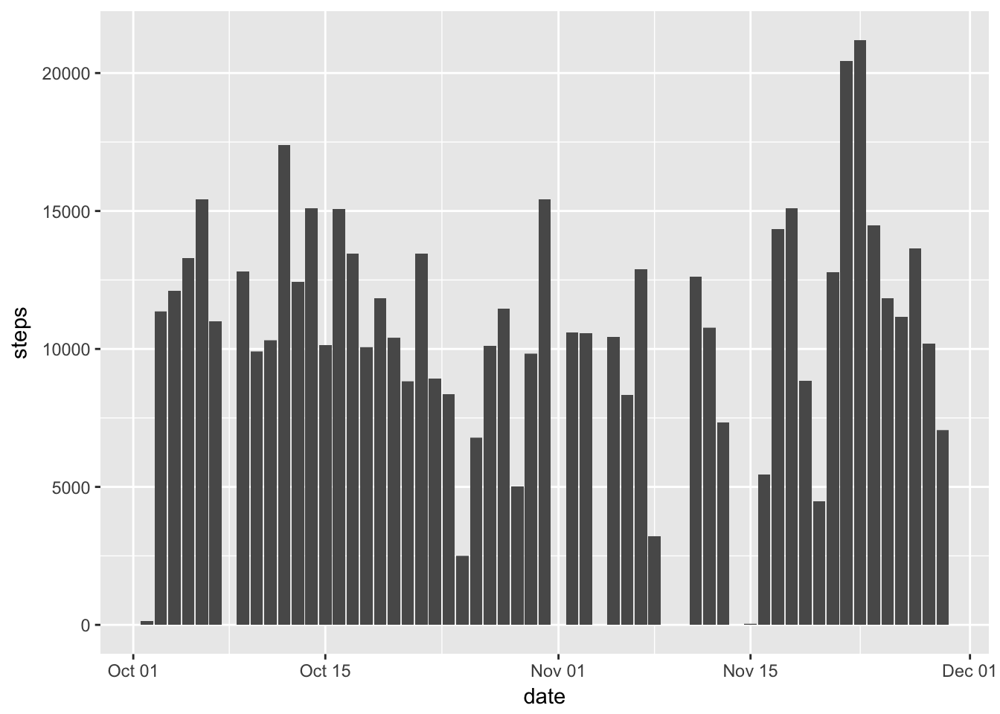
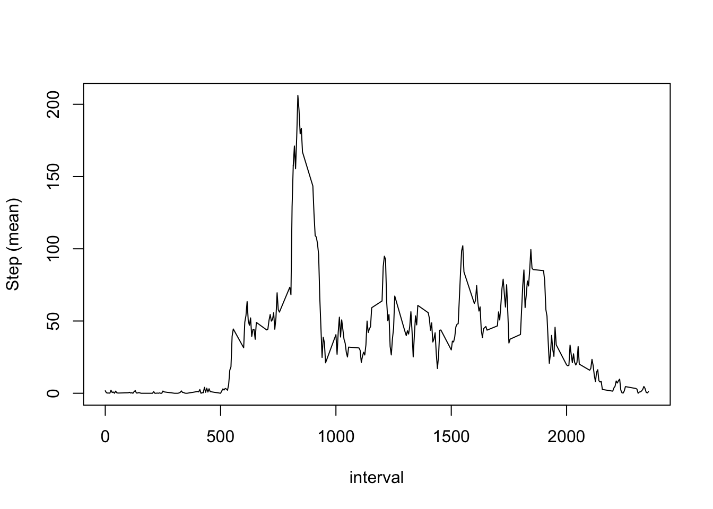
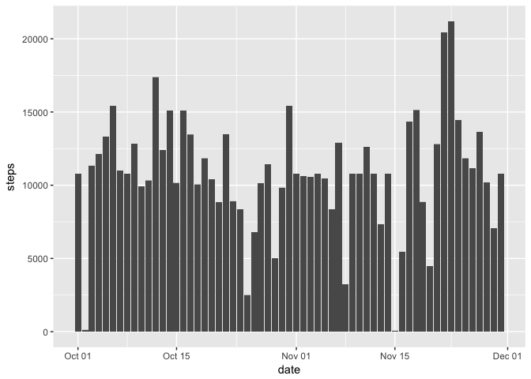
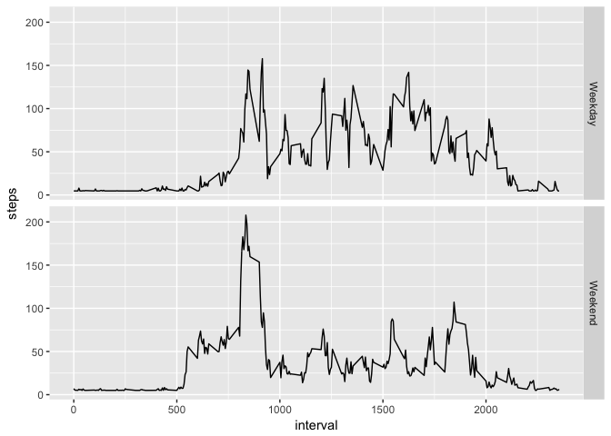

Loading and preprocessing the data
----------------------------------

    knitr::opts_chunk$set(fig.path = "figure/")
    data <- read.csv("activity.csv")
    library(knitr)
    library(ggplot2)
    library(dplyr)
    library(xtable)
    library(lattice)
    data$date <- as.Date(as.character(data$date))
    data$steps <- as.numeric(data$steps)

What is mean total number of steps taken per day?
-------------------------------------------------

You can a see a histogram that shows the number of steps taken each day
along the period of study.

    his <- ggplot(data, aes(date, steps))
    his  + geom_bar(stat = "identity", na.rm = TRUE)

You can also see a table that describe the mean and median for each day
of study.

    data2 <- group_by(data, date)
    kable(summarize(data2, mean = mean(steps, na.rm = FALSE), median = median(steps, na.rm = FALSE)), digits = 2)

<table>
<thead>
<tr class="header">
<th align="left">date</th>
<th align="right">mean</th>
<th align="right">median</th>
</tr>
</thead>
<tbody>
<tr class="odd">
<td align="left">2012-10-01</td>
<td align="right">NA</td>
<td align="right">NA</td>
</tr>
<tr class="even">
<td align="left">2012-10-02</td>
<td align="right">0.44</td>
<td align="right">0</td>
</tr>
<tr class="odd">
<td align="left">2012-10-03</td>
<td align="right">39.42</td>
<td align="right">0</td>
</tr>
<tr class="even">
<td align="left">2012-10-04</td>
<td align="right">42.07</td>
<td align="right">0</td>
</tr>
<tr class="odd">
<td align="left">2012-10-05</td>
<td align="right">46.16</td>
<td align="right">0</td>
</tr>
<tr class="even">
<td align="left">2012-10-06</td>
<td align="right">53.54</td>
<td align="right">0</td>
</tr>
<tr class="odd">
<td align="left">2012-10-07</td>
<td align="right">38.25</td>
<td align="right">0</td>
</tr>
<tr class="even">
<td align="left">2012-10-08</td>
<td align="right">NA</td>
<td align="right">NA</td>
</tr>
<tr class="odd">
<td align="left">2012-10-09</td>
<td align="right">44.48</td>
<td align="right">0</td>
</tr>
<tr class="even">
<td align="left">2012-10-10</td>
<td align="right">34.38</td>
<td align="right">0</td>
</tr>
<tr class="odd">
<td align="left">2012-10-11</td>
<td align="right">35.78</td>
<td align="right">0</td>
</tr>
<tr class="even">
<td align="left">2012-10-12</td>
<td align="right">60.35</td>
<td align="right">0</td>
</tr>
<tr class="odd">
<td align="left">2012-10-13</td>
<td align="right">43.15</td>
<td align="right">0</td>
</tr>
<tr class="even">
<td align="left">2012-10-14</td>
<td align="right">52.42</td>
<td align="right">0</td>
</tr>
<tr class="odd">
<td align="left">2012-10-15</td>
<td align="right">35.20</td>
<td align="right">0</td>
</tr>
<tr class="even">
<td align="left">2012-10-16</td>
<td align="right">52.38</td>
<td align="right">0</td>
</tr>
<tr class="odd">
<td align="left">2012-10-17</td>
<td align="right">46.71</td>
<td align="right">0</td>
</tr>
<tr class="even">
<td align="left">2012-10-18</td>
<td align="right">34.92</td>
<td align="right">0</td>
</tr>
<tr class="odd">
<td align="left">2012-10-19</td>
<td align="right">41.07</td>
<td align="right">0</td>
</tr>
<tr class="even">
<td align="left">2012-10-20</td>
<td align="right">36.09</td>
<td align="right">0</td>
</tr>
<tr class="odd">
<td align="left">2012-10-21</td>
<td align="right">30.63</td>
<td align="right">0</td>
</tr>
<tr class="even">
<td align="left">2012-10-22</td>
<td align="right">46.74</td>
<td align="right">0</td>
</tr>
<tr class="odd">
<td align="left">2012-10-23</td>
<td align="right">30.97</td>
<td align="right">0</td>
</tr>
<tr class="even">
<td align="left">2012-10-24</td>
<td align="right">29.01</td>
<td align="right">0</td>
</tr>
<tr class="odd">
<td align="left">2012-10-25</td>
<td align="right">8.65</td>
<td align="right">0</td>
</tr>
<tr class="even">
<td align="left">2012-10-26</td>
<td align="right">23.53</td>
<td align="right">0</td>
</tr>
<tr class="odd">
<td align="left">2012-10-27</td>
<td align="right">35.14</td>
<td align="right">0</td>
</tr>
<tr class="even">
<td align="left">2012-10-28</td>
<td align="right">39.78</td>
<td align="right">0</td>
</tr>
<tr class="odd">
<td align="left">2012-10-29</td>
<td align="right">17.42</td>
<td align="right">0</td>
</tr>
<tr class="even">
<td align="left">2012-10-30</td>
<td align="right">34.09</td>
<td align="right">0</td>
</tr>
<tr class="odd">
<td align="left">2012-10-31</td>
<td align="right">53.52</td>
<td align="right">0</td>
</tr>
<tr class="even">
<td align="left">2012-11-01</td>
<td align="right">NA</td>
<td align="right">NA</td>
</tr>
<tr class="odd">
<td align="left">2012-11-02</td>
<td align="right">36.81</td>
<td align="right">0</td>
</tr>
<tr class="even">
<td align="left">2012-11-03</td>
<td align="right">36.70</td>
<td align="right">0</td>
</tr>
<tr class="odd">
<td align="left">2012-11-04</td>
<td align="right">NA</td>
<td align="right">NA</td>
</tr>
<tr class="even">
<td align="left">2012-11-05</td>
<td align="right">36.25</td>
<td align="right">0</td>
</tr>
<tr class="odd">
<td align="left">2012-11-06</td>
<td align="right">28.94</td>
<td align="right">0</td>
</tr>
<tr class="even">
<td align="left">2012-11-07</td>
<td align="right">44.73</td>
<td align="right">0</td>
</tr>
<tr class="odd">
<td align="left">2012-11-08</td>
<td align="right">11.18</td>
<td align="right">0</td>
</tr>
<tr class="even">
<td align="left">2012-11-09</td>
<td align="right">NA</td>
<td align="right">NA</td>
</tr>
<tr class="odd">
<td align="left">2012-11-10</td>
<td align="right">NA</td>
<td align="right">NA</td>
</tr>
<tr class="even">
<td align="left">2012-11-11</td>
<td align="right">43.78</td>
<td align="right">0</td>
</tr>
<tr class="odd">
<td align="left">2012-11-12</td>
<td align="right">37.38</td>
<td align="right">0</td>
</tr>
<tr class="even">
<td align="left">2012-11-13</td>
<td align="right">25.47</td>
<td align="right">0</td>
</tr>
<tr class="odd">
<td align="left">2012-11-14</td>
<td align="right">NA</td>
<td align="right">NA</td>
</tr>
<tr class="even">
<td align="left">2012-11-15</td>
<td align="right">0.14</td>
<td align="right">0</td>
</tr>
<tr class="odd">
<td align="left">2012-11-16</td>
<td align="right">18.89</td>
<td align="right">0</td>
</tr>
<tr class="even">
<td align="left">2012-11-17</td>
<td align="right">49.79</td>
<td align="right">0</td>
</tr>
<tr class="odd">
<td align="left">2012-11-18</td>
<td align="right">52.47</td>
<td align="right">0</td>
</tr>
<tr class="even">
<td align="left">2012-11-19</td>
<td align="right">30.70</td>
<td align="right">0</td>
</tr>
<tr class="odd">
<td align="left">2012-11-20</td>
<td align="right">15.53</td>
<td align="right">0</td>
</tr>
<tr class="even">
<td align="left">2012-11-21</td>
<td align="right">44.40</td>
<td align="right">0</td>
</tr>
<tr class="odd">
<td align="left">2012-11-22</td>
<td align="right">70.93</td>
<td align="right">0</td>
</tr>
<tr class="even">
<td align="left">2012-11-23</td>
<td align="right">73.59</td>
<td align="right">0</td>
</tr>
<tr class="odd">
<td align="left">2012-11-24</td>
<td align="right">50.27</td>
<td align="right">0</td>
</tr>
<tr class="even">
<td align="left">2012-11-25</td>
<td align="right">41.09</td>
<td align="right">0</td>
</tr>
<tr class="odd">
<td align="left">2012-11-26</td>
<td align="right">38.76</td>
<td align="right">0</td>
</tr>
<tr class="even">
<td align="left">2012-11-27</td>
<td align="right">47.38</td>
<td align="right">0</td>
</tr>
<tr class="odd">
<td align="left">2012-11-28</td>
<td align="right">35.36</td>
<td align="right">0</td>
</tr>
<tr class="even">
<td align="left">2012-11-29</td>
<td align="right">24.47</td>
<td align="right">0</td>
</tr>
<tr class="odd">
<td align="left">2012-11-30</td>
<td align="right">NA</td>
<td align="right">NA</td>
</tr>
</tbody>
</table>

What is the average daily activity pattern?
-------------------------------------------

To observe the activity along the day by intervals, a time series plot
was created as follows.

    stepsinterval <- aggregate(steps ~ interval , data = data, FUN = mean) 
    with(stepsinterval, plot(interval, steps, type = "l", main ="", ylab = "Step (mean)"))

    steps <- max(stepsinterval$steps)
    interval <- stepsinterval[stepsinterval$steps == steps, 1]

The interval with the highest number of steps on averages is the 835
interval with 206.1698113 steps on average.

Imputing missing values
-----------------------

The number of missin values can be read in the following table.

    nas <- table(is.na(data$steps))
    names(nas) <- c("Values", "Missing Values")
    print(nas)

    ##         Values Missing Values 
    ##          15264           2304

The code to impute the missing values using average steps by intervales
is the following:

    library(Hmisc)
    library(plyr)
    data <- group_by(data, interval)
    data <- as.data.frame(mutate(data, steps = impute(steps, mean)))
    data$steps <- as.numeric(data$steps)

Using the following code to see a table with means and medians of each
day after imputing missing values don't seem to be diferent from the
previous data.

    detach(package:Hmisc)
    detach(package:plyr)
    data2 <- group_by(data, date)
    kable(summarize(data2, mean = mean(steps), median = median(steps)), digits = 2)

<table>
<thead>
<tr class="header">
<th align="left">date</th>
<th align="right">mean</th>
<th align="right">median</th>
</tr>
</thead>
<tbody>
<tr class="odd">
<td align="left">2012-10-01</td>
<td align="right">37.38</td>
<td align="right">37.38</td>
</tr>
<tr class="even">
<td align="left">2012-10-02</td>
<td align="right">0.44</td>
<td align="right">0.00</td>
</tr>
<tr class="odd">
<td align="left">2012-10-03</td>
<td align="right">39.42</td>
<td align="right">0.00</td>
</tr>
<tr class="even">
<td align="left">2012-10-04</td>
<td align="right">42.07</td>
<td align="right">0.00</td>
</tr>
<tr class="odd">
<td align="left">2012-10-05</td>
<td align="right">46.16</td>
<td align="right">0.00</td>
</tr>
<tr class="even">
<td align="left">2012-10-06</td>
<td align="right">53.54</td>
<td align="right">0.00</td>
</tr>
<tr class="odd">
<td align="left">2012-10-07</td>
<td align="right">38.25</td>
<td align="right">0.00</td>
</tr>
<tr class="even">
<td align="left">2012-10-08</td>
<td align="right">37.38</td>
<td align="right">37.38</td>
</tr>
<tr class="odd">
<td align="left">2012-10-09</td>
<td align="right">44.48</td>
<td align="right">0.00</td>
</tr>
<tr class="even">
<td align="left">2012-10-10</td>
<td align="right">34.38</td>
<td align="right">0.00</td>
</tr>
<tr class="odd">
<td align="left">2012-10-11</td>
<td align="right">35.78</td>
<td align="right">0.00</td>
</tr>
<tr class="even">
<td align="left">2012-10-12</td>
<td align="right">60.35</td>
<td align="right">0.00</td>
</tr>
<tr class="odd">
<td align="left">2012-10-13</td>
<td align="right">43.15</td>
<td align="right">0.00</td>
</tr>
<tr class="even">
<td align="left">2012-10-14</td>
<td align="right">52.42</td>
<td align="right">0.00</td>
</tr>
<tr class="odd">
<td align="left">2012-10-15</td>
<td align="right">35.20</td>
<td align="right">0.00</td>
</tr>
<tr class="even">
<td align="left">2012-10-16</td>
<td align="right">52.38</td>
<td align="right">0.00</td>
</tr>
<tr class="odd">
<td align="left">2012-10-17</td>
<td align="right">46.71</td>
<td align="right">0.00</td>
</tr>
<tr class="even">
<td align="left">2012-10-18</td>
<td align="right">34.92</td>
<td align="right">0.00</td>
</tr>
<tr class="odd">
<td align="left">2012-10-19</td>
<td align="right">41.07</td>
<td align="right">0.00</td>
</tr>
<tr class="even">
<td align="left">2012-10-20</td>
<td align="right">36.09</td>
<td align="right">0.00</td>
</tr>
<tr class="odd">
<td align="left">2012-10-21</td>
<td align="right">30.63</td>
<td align="right">0.00</td>
</tr>
<tr class="even">
<td align="left">2012-10-22</td>
<td align="right">46.74</td>
<td align="right">0.00</td>
</tr>
<tr class="odd">
<td align="left">2012-10-23</td>
<td align="right">30.97</td>
<td align="right">0.00</td>
</tr>
<tr class="even">
<td align="left">2012-10-24</td>
<td align="right">29.01</td>
<td align="right">0.00</td>
</tr>
<tr class="odd">
<td align="left">2012-10-25</td>
<td align="right">8.65</td>
<td align="right">0.00</td>
</tr>
<tr class="even">
<td align="left">2012-10-26</td>
<td align="right">23.53</td>
<td align="right">0.00</td>
</tr>
<tr class="odd">
<td align="left">2012-10-27</td>
<td align="right">35.14</td>
<td align="right">0.00</td>
</tr>
<tr class="even">
<td align="left">2012-10-28</td>
<td align="right">39.78</td>
<td align="right">0.00</td>
</tr>
<tr class="odd">
<td align="left">2012-10-29</td>
<td align="right">17.42</td>
<td align="right">0.00</td>
</tr>
<tr class="even">
<td align="left">2012-10-30</td>
<td align="right">34.09</td>
<td align="right">0.00</td>
</tr>
<tr class="odd">
<td align="left">2012-10-31</td>
<td align="right">53.52</td>
<td align="right">0.00</td>
</tr>
<tr class="even">
<td align="left">2012-11-01</td>
<td align="right">37.38</td>
<td align="right">37.38</td>
</tr>
<tr class="odd">
<td align="left">2012-11-02</td>
<td align="right">36.81</td>
<td align="right">0.00</td>
</tr>
<tr class="even">
<td align="left">2012-11-03</td>
<td align="right">36.70</td>
<td align="right">0.00</td>
</tr>
<tr class="odd">
<td align="left">2012-11-04</td>
<td align="right">37.38</td>
<td align="right">37.38</td>
</tr>
<tr class="even">
<td align="left">2012-11-05</td>
<td align="right">36.25</td>
<td align="right">0.00</td>
</tr>
<tr class="odd">
<td align="left">2012-11-06</td>
<td align="right">28.94</td>
<td align="right">0.00</td>
</tr>
<tr class="even">
<td align="left">2012-11-07</td>
<td align="right">44.73</td>
<td align="right">0.00</td>
</tr>
<tr class="odd">
<td align="left">2012-11-08</td>
<td align="right">11.18</td>
<td align="right">0.00</td>
</tr>
<tr class="even">
<td align="left">2012-11-09</td>
<td align="right">37.38</td>
<td align="right">37.38</td>
</tr>
<tr class="odd">
<td align="left">2012-11-10</td>
<td align="right">37.38</td>
<td align="right">37.38</td>
</tr>
<tr class="even">
<td align="left">2012-11-11</td>
<td align="right">43.78</td>
<td align="right">0.00</td>
</tr>
<tr class="odd">
<td align="left">2012-11-12</td>
<td align="right">37.38</td>
<td align="right">0.00</td>
</tr>
<tr class="even">
<td align="left">2012-11-13</td>
<td align="right">25.47</td>
<td align="right">0.00</td>
</tr>
<tr class="odd">
<td align="left">2012-11-14</td>
<td align="right">37.38</td>
<td align="right">37.38</td>
</tr>
<tr class="even">
<td align="left">2012-11-15</td>
<td align="right">0.14</td>
<td align="right">0.00</td>
</tr>
<tr class="odd">
<td align="left">2012-11-16</td>
<td align="right">18.89</td>
<td align="right">0.00</td>
</tr>
<tr class="even">
<td align="left">2012-11-17</td>
<td align="right">49.79</td>
<td align="right">0.00</td>
</tr>
<tr class="odd">
<td align="left">2012-11-18</td>
<td align="right">52.47</td>
<td align="right">0.00</td>
</tr>
<tr class="even">
<td align="left">2012-11-19</td>
<td align="right">30.70</td>
<td align="right">0.00</td>
</tr>
<tr class="odd">
<td align="left">2012-11-20</td>
<td align="right">15.53</td>
<td align="right">0.00</td>
</tr>
<tr class="even">
<td align="left">2012-11-21</td>
<td align="right">44.40</td>
<td align="right">0.00</td>
</tr>
<tr class="odd">
<td align="left">2012-11-22</td>
<td align="right">70.93</td>
<td align="right">0.00</td>
</tr>
<tr class="even">
<td align="left">2012-11-23</td>
<td align="right">73.59</td>
<td align="right">0.00</td>
</tr>
<tr class="odd">
<td align="left">2012-11-24</td>
<td align="right">50.27</td>
<td align="right">0.00</td>
</tr>
<tr class="even">
<td align="left">2012-11-25</td>
<td align="right">41.09</td>
<td align="right">0.00</td>
</tr>
<tr class="odd">
<td align="left">2012-11-26</td>
<td align="right">38.76</td>
<td align="right">0.00</td>
</tr>
<tr class="even">
<td align="left">2012-11-27</td>
<td align="right">47.38</td>
<td align="right">0.00</td>
</tr>
<tr class="odd">
<td align="left">2012-11-28</td>
<td align="right">35.36</td>
<td align="right">0.00</td>
</tr>
<tr class="even">
<td align="left">2012-11-29</td>
<td align="right">24.47</td>
<td align="right">0.00</td>
</tr>
<tr class="odd">
<td align="left">2012-11-30</td>
<td align="right">37.38</td>
<td align="right">37.38</td>
</tr>
</tbody>
</table>

The following plot uses the data where missing values were imputed. It
seems not to be so different from the previous plot with missing values.

    his3 <- ggplot(data, aes(date, steps))
    his3  + geom_bar(stat = "identity", na.rm = TRUE)

Are there differences in activity patterns between weekdays and weekends?
-------------------------------------------------------------------------

Let's create first a factor variable for weekends and weekdays.

    data$day <- factor(ifelse(weekdays(data$date) == "Sunday" | weekdays(data$date) == "Saturday", "Weekday", "Weekend"))

If we see the following plots, we can notice two differences between
weekdays and weekends. First, activity on weekdays seems to be higher
compared to weekends. However, and this is the second diferences, the
morningn intervals during the weekeends are more intensive.

    his3 <- ggplot(data, aes(interval, steps))
    his3  + stat_summary(fun.y = "mean", geom = "line") + facet_grid(day ~ .)

